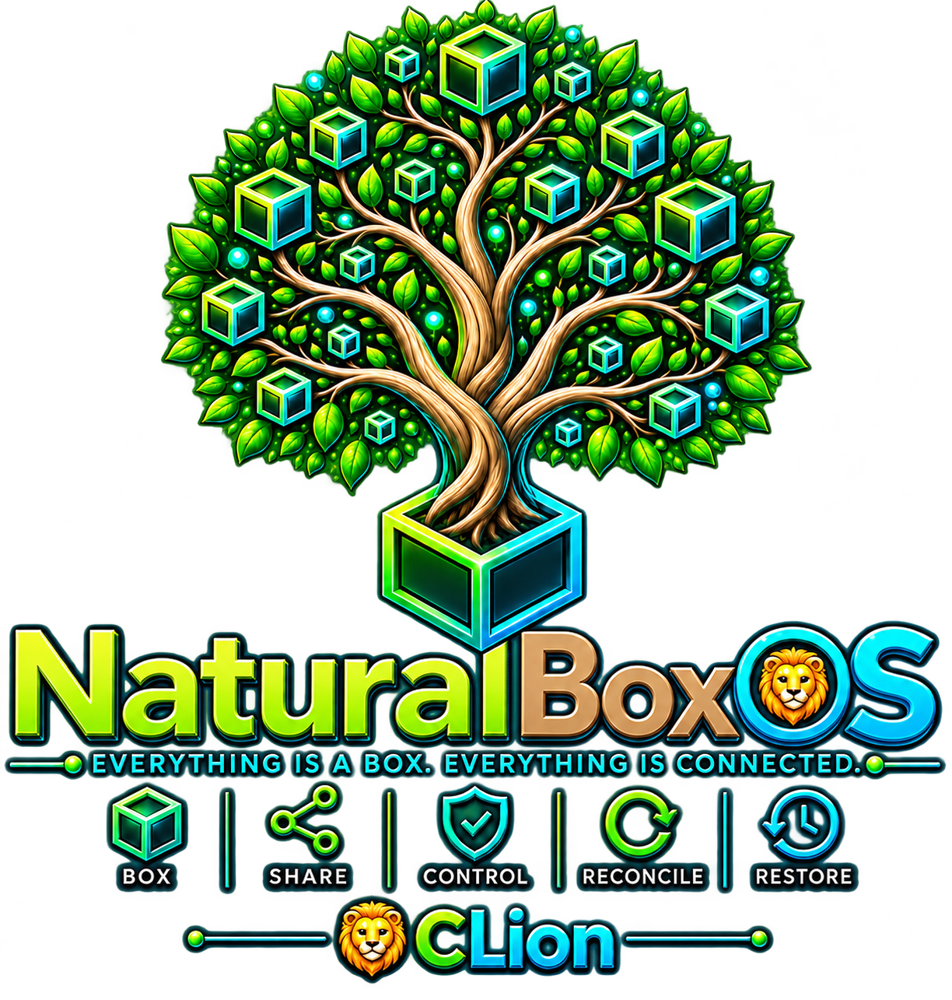

# NaturalBoxOS

> **"One elegant design is better than a thousand lines of code."**
>
> — 🦁 CLion

NaturalBoxOS is a **specification-first operating system architecture** built on top of the Linux kernel.

It is not another Linux distribution. It is an attempt to rethink how an operating system should organize software, dependencies, configuration, sharing, backup, restoration, and user control while preserving the strengths of the Linux kernel.

NaturalBoxOS is based on one simple idea:

> **Everything is a Box. Everything is Connected.**

---

# Vision

NaturalBoxOS treats every manageable object as a **Box**.

Applications.

Libraries.

Configurations.

Operating system components.

Projects.

Development environments.

Everything is represented uniformly.

The entire system is designed around explicit relationships instead of hidden package manager state, allowing users to understand, inspect, modify, back up, restore, and share every part of their system.

---

# Development Philosophy

The project follows a strict **Specification First** development process.

Implementation never defines behavior.

The Specification defines behavior.

The implementation exists only to realize the Specification.

Every architectural decision is documented before code is written.

---

# Project Status

🟢 Specification Development

Current work focuses on designing and freezing the architecture before implementing the reference tools.

Development order:

1. Glossary
2. Core Specification
3. Reference Algorithms
4. Bash Reference Implementation
5. Testing
6. Documentation

---

# Repository Structure

```
SPECIFICATION/
IMPLEMENTATION/
REFERENCE/
TESTS/
DOCS/
```

---

# Author

**🦁 CLion**

Architect and Creator of NaturalBoxOS

---

## Attribution

Architecture and original concepts:

**🦁 CLion**

Editorial work, specification engineering, technical review, and collaborative refinement:

---

## License

To be announced.
